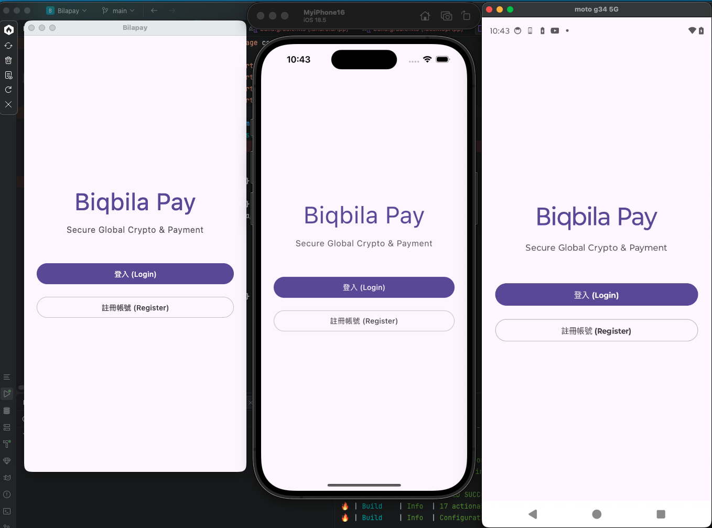

# Bilapay

Bilapay 是一個跨平台（Kotlin Multiplatform / Compose Multiplatform）應用程式專案，支援 Android、Desktop 與 iOS。

## 專案預覽



## 專案結構

- **`androidApp/`**: Android 應用程式模組。
- **`desktopApp/`**: Desktop 應用程式模組 (Compose for Desktop)。
- **`iosApp/`**: iOS 應用程式模組。
- **`shared/`**: 跨平台共用邏輯與 UI 模組。
- **`docs/images/`**: 專案相關文件與圖片資源。

## 技術棧

- **Kotlin Multiplatform (KMP)**
- **Compose Multiplatform**
- **Gradle Kotlin DSL**

## 建置與執行

### Android
```bash
./gradlew :androidApp:assembleDebug
```

### Desktop
```bash
./gradlew :desktopApp:run
```
